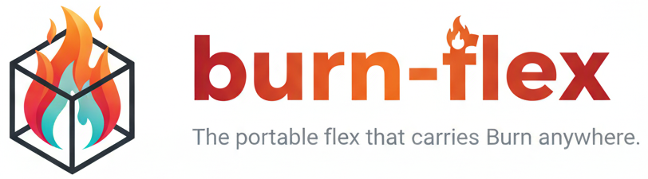

  

## burn-flex - The portable flex that carries Burn anywhere.

A fast, memory-efficient CPU backend for Burn with multi-threading, SIMD, and optimized matrix
multiplication. Runs on std, no_std, and WebAssembly. Supports f16/bf16, zero-copy data loading, and
is thread-safe by design.

> **[Detailed comparison with burn-ndarray](COMPARISON.md)**: Full architecture, feature coverage,
> operation-by-operation analysis, and migration path.

### Features

- **Zero-Copy Operations**: Many operations return strided views without copying data:
  - `transpose`, `permute`, `flip`, `narrow`, `slice`
  - `unfold` (sliding windows as strided view instead of materialization)
  - `expand` (broadcast via zero strides)
- **Arc-based Copy-on-Write**: O(1) tensor cloning with automatic COW semantics. In-place mutation
  when uniquely owned.
- **Convolutions**: Unified 3D implementation with im2col + gemm. Conv1d/2d delegate to conv3d.
  Supports groups, dilation, padding.
- **Attention**: Auto-selecting between two gemm-backed strategies based on sequence length. Short
  sequences (score matrix seq_q * seq_kv <= 256K elements) use naive attention with two large gemm
  calls for lower overhead. Larger shapes use tiled flash attention with online softmax for
  O(TILE_KV) memory per row. Both support causal masking, additive bias (ALiBi), softcap, custom
  scale, and cross-attention.
- **Pooling**: Max pool, avg pool, adaptive avg pool. All via unified 3D with backward pass support.
- **Conv Transpose**: Scatter-based transposed convolutions for upsampling.
- **Portable SIMD**: Uses [macerator](https://crates.io/crates/macerator) for automatic dispatch:
  - aarch64: NEON
  - x86_64: AVX2, AVX512, SSE
  - wasm32: SIMD128
  - Embedded/other: Scalar fallback
- **Matrix Multiplication**: Optimized via [gemm](https://crates.io/crates/gemm) with native f16
  support
- **FFT**: Real FFT (rfft) via Cooley-Tukey with complex packing, mixed radix-4/radix-2, compile-time
  twiddle tables, and SIMD butterflies. ~2.5x of rustfft while maintaining `no_std` support.
- **Parallel Execution**: Optional rayon for large tensors
- **Quantization**: Full quantize/dequantize support with per-tensor and per-block symmetric
  schemes. All ~40 quantized ops (arithmetic, trig, reductions, sorting, etc.) work out of the box.
  Layout ops on quantized tensors (permute, flip, expand, slice, select) are zero-copy. Stores
  scales separately for direct `scale * x_q` dequantization instead of reparsing packed bytes.
- **Dtype Support**: f32, f64, f16 (native), bf16 (via f32 conversion), i8-i64, u8-u64
- **Built on Burn**: Leverages Burn's native infrastructure (`Bytes`, `Shape`, `TensorData`,
  `Element` trait) from burn-backend and burn-std

### Why replace burn-ndarray?

burn-ndarray depends on the [ndarray](https://crates.io/crates/ndarray) crate, which has been slow
to accept contributions and evolve.

burn-flex was built as a from-scratch replacement that addresses the gaps while maintaining full
compatibility with Burn's backend test suite.

### Performance vs burn-ndarray (Apple M3 Max)

#### Compute Performance

Genuine algorithmic and library improvements (gemm over matrixmultiply, SIMD reductions, Arc COW for
buffer reuse):

| Category          | Speedup      | Highlights                                |
| ----------------- | ------------ | ----------------------------------------- |
| Binary ops (f32)  | **2.4-3.6x** | 3x less memory allocation                 |
| Binary ops (i64)  | **1.5-6.4x** | Smaller tensors see bigger gains          |
| Matmul (square)   | **1.1-3.4x** | Up to 2.3x at 1024x1024                   |
| Matmul (batched)  | **1.8-3.2x** | 3.2x on multi-head attention shapes       |
| Conv2d (3x3)      | **1.4-4.0x** | Larger kernels and batches benefit most   |
| Conv1d            | **4.3-9.6x** |                                           |
| Attention         | **1.2-2.4x** | Flash attention, 2-8.5x lower peak memory |
| Pooling           | **1.2-3.1x** |                                           |
| Interpolation     | **1.2-3.6x** | All modes: nearest, bilinear, bicubic     |
| Reductions        | **1.6-5.1x** | Near-zero allocation for scalar results   |
| Cumulative ops    | **3.1-93x**  | 1D cumsum: 93x faster                     |
| Gather/scatter    | **1.9-9.7x** |                                           |
| Unary (tanh, sin) | **1.3-2.7x** |                                           |
| Comparisons       | **2.1-3.9x** |                                           |
| Int casting       | **5.0-7.6x** |                                           |
| Quantize          | **1.6x**     | Fused 2-pass implementation               |
| FFT (rfft)        | **~2.5x of rustfft** | no_std; rustfft requires std       |

#### Structural Improvements

These reflect better _operation representation_, not faster computation. burn-ndarray eagerly
materializes data for these operations; burn-flex avoids the work entirely through zero-copy views
and separated storage layouts.

| Category      | Improvement        | What changed                                                 |
| ------------- | ------------------ | ------------------------------------------------------------ |
| Dequantize    | **135-232x**       | Direct `scale * x_q` vs reparsing `QuantizedBytes` each call |
| Quantized ops | **2.9-117x**       | Dominated by fast dequantize path above                      |
| Slice/narrow  | **2.1-2,100x**     | Zero-copy strided view vs potential data copy                |
| Unfold        | **1,200-166,000x** | O(1) strided view vs O(n) full materialization               |
| Expand        | **550-2,600x**     | Zero-copy broadcast (stride=0) vs data copy                  |

> **Note on quantization**: burn-ndarray simulates quantization by dequantizing to f32 for most
> operations. The quantized speedups reflect the difference between simulated and native execution,
> not equivalent algorithms running at different speeds.

See [BENCHMARKS.md](BENCHMARKS.md) for the full breakdown.

### Status

- All `burn-backend-tests` pass across all feature flag combinations:
  - `no-default-features` (no_std, no SIMD, no rayon)
  - `no-default-features + simd` (no_std with SIMD)
  - `std`
  - `std + simd`
  - `std + rayon`
  - `std + simd + rayon` (default)
- Burn's `burn-no-std-tests` integration suite passes (MNIST model inference in `#![no_std]`)
- Builds for embedded and WebAssembly targets:
  - `thumbv6m-none-eabi` (ARM Cortex-M0+, no atomic pointers)
  - `thumbv7m-none-eabi` (ARM Cortex-M3)
  - `wasm32-unknown-unknown`
- Passes [Miri](https://github.com/rust-lang/miri) (undefined behavior detector) on all burn-flex
  code (quantization tests skipped due to upstream UB in burn-std). Validates memory safety of
  unsafe pointer arithmetic, bytemuck casts, and Send/Sync implementations.
- Tested for edge-case robustness: integer overflow at type boundaries, large-float rounding,
  invalid pooling parameters, zero-sized dimensions. Safe for embedded devices.
- All ONNX model checks in `burn-onnx` pass
- Real model inference verified:
  - [ALBERT](https://huggingface.co/albert/albert-base-v2) (masked language model, all v2 variants)
  - [MiniLM](https://huggingface.co/sentence-transformers/all-MiniLM-L6-v2) (sentence embeddings, L6
    and L12)

### Documentation

- [COMPARISON.md](COMPARISON.md) - Comprehensive comparison with burn-ndarray
- [ARCHITECTURE.md](ARCHITECTURE.md) - Design decisions, memory strategy, and implementation
  patterns
- [BENCHMARKS.md](BENCHMARKS.md) - Full benchmark results (Flex vs NdArray)
- [ACKNOWLEDGMENTS.md](ACKNOWLEDGMENTS.md) - Projects that influenced burn-flex
